<div align="center">




[](https://git.io/typing-svg)


</div>

## Introduction

I am **Anam Bactiar**, an early-stage developer focused on building a solid base in **Python**, **JS**, and **Web3**.

I learn by creating small projects, improving old repositories, and studying how real developers structure readable work. My current goal is simple: become more consistent, more precise, and more confident with every project I publish.

<div align="center">


</div>

## Core Stack

<div align="center">


<br />


</div>

## Developer Profile

```text
Main focus      Python, JS, Web3
Learning style  Build, review, improve, repeat
Mindset         Start simple, polish steadily
Direction       Better code quality and stronger project structure
```

## GitHub Overview

<div align="center">


<br />


<br />


</div>

## Current Growth

```text
Python fundamentals        ████████████░░░░░░░  60%
JS fundamentals            ██████████░░░░░░░░░  50%
Web3 knowledge             ████████░░░░░░░░░░░  40%
GitHub project quality     ███████░░░░░░░░░░░░  35%
```

## Connect

<div align="center">

[](https://t.me/anambactiar)
[](https://x.com/anambactiar?t=Z3Vxm_V-Ie44wFTt-AaJnA&s=09)
[](https://warpcast.com/anam01)


</div>
